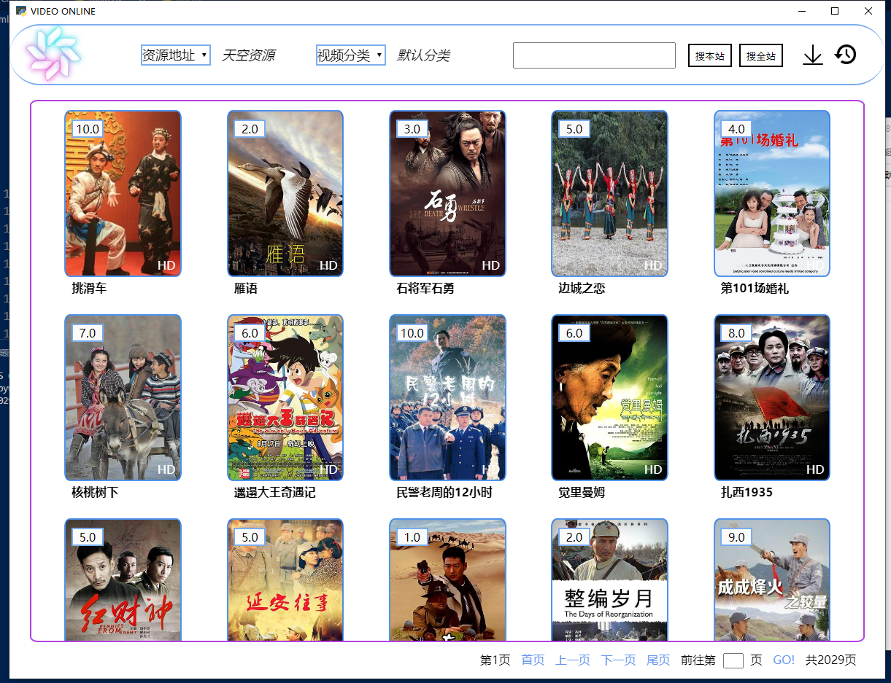
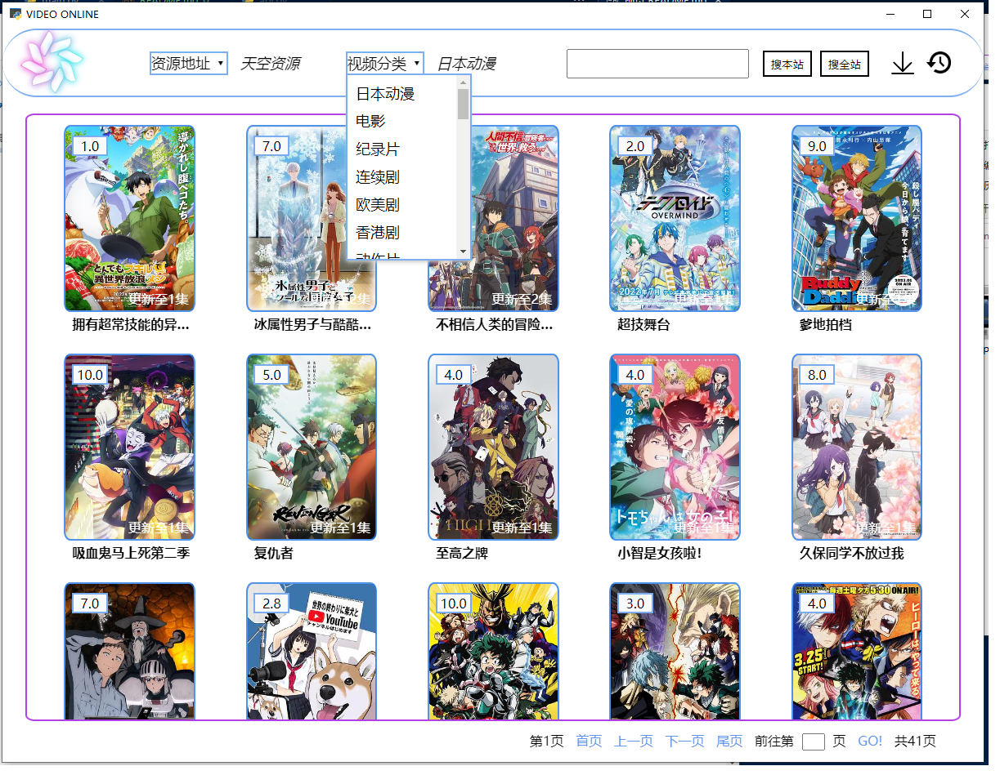
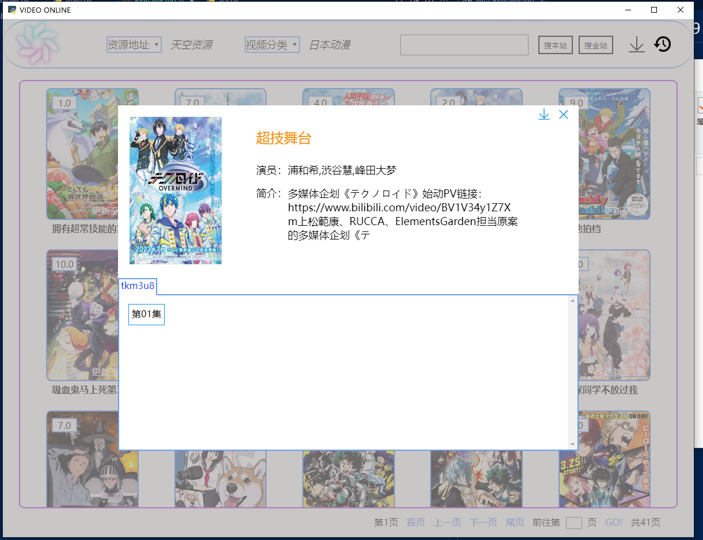
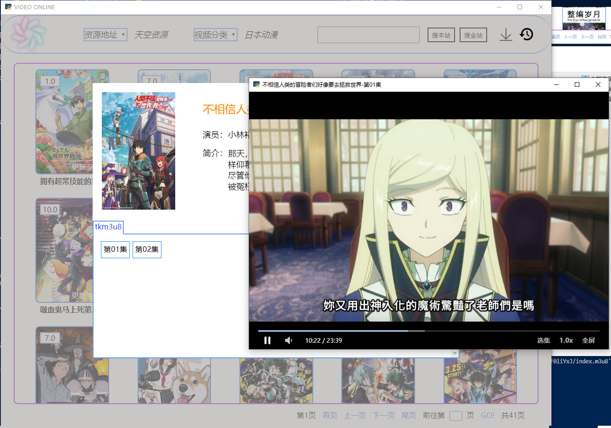

# An app based on python 3.7.9 and [pywebview 3.7](https://pywebview.flowrl.com/)

## 已实现功能：

* ## 抓取视频链接
* ## 分类获取视频
* ## 视频播放
* ## src/classes.py的hlsdowndloader类实现了多线程下载m3u8视频

# 预览
## 首页

## 分类

## 视频详情

## 播放

***
# 声明
># <b>资源来自网络</b>